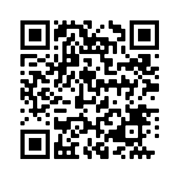

# NFT Plate - Explore the World of NFTs

## Introduction

Have you ever seen an NFT license plate and wondered what it's all about? Welcome to NFT Plate, your gateway to the fascinating world of Non-Fungible Tokens (NFTs).

## What Are Non-Fungible Tokens (NFTs)?

NFTs are revolutionizing the digital art and collectibles industry, transforming the lives of digital artists and creating new opportunities for celebrities to connect with their fans. But NFTs are not limited to art; they can represent ownership of unique assets in both the digital and physical realms.

Imagine if Andy Warhol were born in the late '90s; he might have minted his iconic works as NFTs. It's only a matter of time before we see Kanye West tokenizing his Yeezys on Ethereum. NFTs could even prove ownership of your car one day.

Learn more about NFTs at the [Ethereum Foundation](https://ethereum.org/en/nft/).

### "Bored Ape" Digital Art NFT

Explore a live NFT auction: [View Live NFT Here](https://opensea.io/assets/0xbc4ca0eda7647a8ab7c2061c2e118a18a936f13d/3749)

Currently selling for 35 ETH (~$143,000 USD).

## How Do NFTs Work?

NFTs are unique units of data stored on a blockchain, enabling them to be bought and traded. Each NFT can represent a specific digital or physical asset along with a license for its use. Unlike cryptocurrencies like Bitcoin, NFTs are not interchangeable, as each may represent a different asset with its own value.

NFTs are created through cryptographic transactions on blockchains, providing a secure and trackable ownership system. However, it's crucial to maintain data links to preserve access to the associated assets.

## NFTs in the Media

Stay informed about NFTs with these articles:

- [The Verge - What is an NFT](https://www.theverge.com/22310188/nft-explainer-what-is-blockchain-crypto-art-faq)
- [Forbes - What You Need To Know About Non-Fungible Tokens (NFTs)](https://www.forbes.com/advisor/investing/nft-non-fungible-token/)
- [BBC - What are NFTs and why are some worth millions?](https://www.bbc.com/news/technology-56371912)
- [The Economist - What is an NFT?](https://www.economist.com/the-economist-explains/2021/10/12/what-is-an-nft)

## Why NFT Plate?

Is it nerdy to have an NFT license plate and a whole website about it? Absolutely! Did it teach you something new? I hope so! So why did I do it? Because I love helping people learn about blockchain!

## Contact Us

Have questions or want to say hello? Feel free to drop us a message at [nftplate15@gmail.com](mailto:nftplate15@gmail.com).

## Donations Welcome

Support NFT Plate with your donations. Here's our ETH address:

ETH Address: 0x882b2C88FF274ddb44150550EA2ef29716Ed1C8a

<!-- 

NFT Plate - Find Out More About NFTs

#### Did you see my license plate and wonder what it meant? 

 

## What are Non-Fungible Tokens? (NFTs)
NFTs are currently taking the digital art and collectibles world by storm. Digital artists are seeing their lives change thanks to huge sales to a new crypto-audience. And celebrities are joining in as they spot a new opportunity to connect with fans. But digital art is only one way to use NFTs. Really they can be used to represent ownership of any unique asset, like a deed for an item in the digital or physical realm.

If Andy Warhol had been born in the late 90s, he probably would have minted Campbell's Soup as an NFT. It's only a matter of time before Kanye puts a run of Yeezys on Ethereum. And one day owning your car might be proved with an NFT.
#### [Read More at the Ethereum Foundation](https://ethereum.org/en/nft/)

#### "Bored Ape" Digital Art NFT - [View Live NFT Here](https://opensea.io/assets/0xbc4ca0eda7647a8ab7c2061c2e118a18a936f13d/3749)

##### Currently selling for 35 ETH (~$143,000 USD)

## How do NFTs Work?
An NFT is a unit of data stored on a digital ledger, called a blockchain, which can be sold and traded. The NFT can be associated with a particular digital or physical asset (such as a file or a physical object) and a license to use the asset for a specified purpose. NFTs (and the associated license to use, copy or display the underlying asset) can be traded and sold on digital markets.

NFTs function like cryptographic tokens, but, unlike cryptocurrencies like Bitcoin, NFTs are not mutually interchangeable, hence not fungible. While all bitcoins are equal, each NFT may represent a different underlying asset and thus have a different value. NFTs are created when blockchains string records of cryptographic hash, a set of characters identifying a set of data, onto previous records therefore creating a chain of identifiable data blocks. This cryptographic transaction process ensures the authentication of each digital file by providing a digital signature that is used to track NFT ownership. However, data links that point to details like where the art is stored can die.

## NFTs in the Media
- [The Verge - What is an NFT](https://www.theverge.com/22310188/nft-explainer-what-is-blockchain-crypto-art-faq)
- [Forbes - What You Need To Know About Non-Fungible Tokens (NFTs)](https://www.forbes.com/advisor/investing/nft-non-fungible-token/)
- [BBC - What are NFTs and why are some worth millions?](https://www.bbc.com/news/technology-56371912)
- [The Economist - What is an NFT?](https://www.economist.com/the-economist-explains/2021/10/12/what-is-an-nft)

#### Is having an NFT license plate and whole website about it nerdy? Hell YES it is! Did it teach you something new? I hope so! So why did I do it? I love helping people learn about blockchain! 

## <a href="mailto:nftplate15@gmail.com?subject=Saw Your NFT Plate">Drop me a message to say hello! </a>
_I hope my driving was ok, if not, please accept my apologies._

## Donations Welcome - ETH Address: 0x882b2C88FF274ddb44150550EA2ef29716Ed1C8a

--> 

